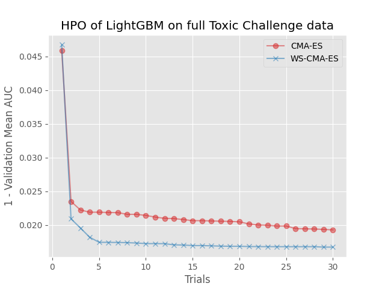

## benchmark-warm-starting-cmaes

Benchmark codes for Warm Starting CMA-ES (Optuna PR: https://github.com/optuna/optuna/pull/2307).

> Masahiro Nomura, Shuhei Watanabe, Youhei Akimoto, Yoshihiko Ozaki, Masaki Onishi. “Warm Starting CMA-ES for Hyperparameter Optimization”, AAAI. 2021.
> https://arxiv.org/abs/2012.06932



The benchmark problem is a hyperparameter optimization of LightGBM with [Kaggle's Toxic Comment Classification Challenge data](https://www.kaggle.com/c/jigsaw-toxic-comment-classification-challenge), a multilabel classification dataset which is used at the paper.
This problem uses 10% of a full dataset as the source task, and a full dataset as the target task.
The search space consists of six hyper parameters like the following:

```python
params = {
    'learning_rate': trial.suggest_float("learning_rate", 1e-3, 1.0, log=True),
    'num_leaves': trial.suggest_int("num_leaves", 8, 128, log=True),
    'bagging_fraction': trial.suggest_float("bagging_fraction", 0.1, 0.9),
    'feature_fraction': trial.suggest_float("feature_fraction", 0.1, 0.9),
    'lambda_l1': trial.suggest_float("lambda_l1", 1e-1, 10, log=True),
    'lambda_l2': trial.suggest_float("lambda_l2", 1e-1, 10, log=True),
    'application': 'binary',
    'verbosity': -1,
    'metric': 'auc',
    'data_random_seed': 2,
    'nthread': 4
}
score = lgb.cv(
    params,
    train_set=d_train,
    nfold=5,
    stratified=True,
    num_boost_round=rounds_lookup[class_name],
    verbose_eval=10
)
```

Please check the paper for more details of experiment settings.

## How to run benchmark

### Local

*Please note that this benchmark requires 5-7 days on my macbook pro.*

```
$ python3.8 -m venv venv
$ source venv/bin/activate
(venv) $ pip install -r requirements.txt
(venv) $ python benchmark_local.py
(venv) $ python plot_result.png
```

### GCP AI Platform Training (Recommended)

```
$ export SLACK_WEBHOOK_URL=https://hooks.slack.com/services/xxxxxxxxxxxxxxxxxxxxxxxxx
$ export SLACK_WEBHOOK_CHANNEL=xxxxxxxxxxxxx
$ export GCS_PATH=gs://xxxxxxxxxxxx/
$ export IMAGE_URI=asia.gcr.io/xxxxxx/shibata_wscmaes_bench:latest
$ SEED=1 ./submit-aiplatform-training-job.sh
$ SEED=2 ./submit-aiplatform-training-job.sh
$ SEED=3 ./submit-aiplatform-training-job.sh
$ SEED=4 ./submit-aiplatform-training-job.sh
$ SEED=5 ./submit-aiplatform-training-job.sh
$ SEED=6 ./submit-aiplatform-training-job.sh
$ SEED=7 ./submit-aiplatform-training-job.sh
$ SEED=8 ./submit-aiplatform-training-job.sh
$ SEED=9 ./submit-aiplatform-training-job.sh
$ SEED=10 ./submit-aiplatform-training-job.sh
$ SEED=11 ./submit-aiplatform-training-job.sh
$ SEED=12 ./submit-aiplatform-training-job.sh
```

Download SQLite3 files from the GCS and put them into the `db` directory.

```
$ mkdir db
$ gsutil cp -r ... ./db  # download sqlite3 files
$ python3.8 -m venv venv
$ source venv/bin/activate
(venv) $ pip install -r requirements.txt
(venv) $ python merge_sqlite3_aiplatform.py  # it may need to modify sqlite3 filenames due to the path of GCS.
(venv) $ python plot_result.png
```

